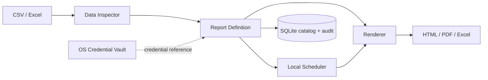
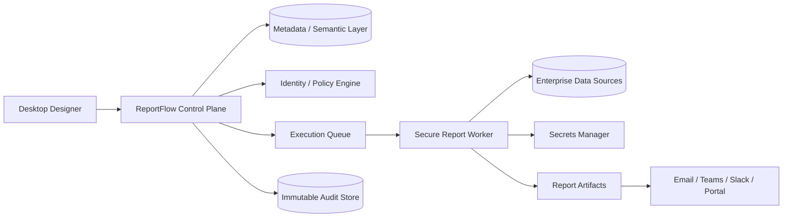

# نقشهٔ راه تجاری ReportFlow

**نسخهٔ مبنا:** 1.0.0 Desktop  
**وضعیت:** هستهٔ محصول محلی و آمادهٔ عرضهٔ آزمایشی

## جمع‌بندی محصول

ReportFlow از یک اسکریپت نمونه به یک محصول دسکتاپ **محلی‌محور، قابل‌تکرار و قابل‌ممیزی** بازطراحی شده است. این نسخه برای تیم‌هایی طراحی شده که گزارش‌های CSV یا Excel را به خروجی‌های استاندارد مدیریتی تبدیل می‌کنند و به کیفیت داده، خروجی PDF/Excel قابل ارائه و اثبات اجرای گزارش نیاز دارند.

> چشم‌انداز محصول: «هر تیم بتواند گزارش سازمانی خود را با سرعت یک داشبورد و قابلیت اتکای یک فرآیند مالی تولید کند.»

## مبنای قابلیت‌های رقابتی

محصولات سازمانی موفق، لایهٔ دادهٔ قابل‌اعتماد، حاکمیت، خودخدمتی و توزیع زمان‌بندی‌شده را در کنار هم قرار می‌دهند. Power BI برای گزارش‌های چاپی کنترل دقیق صفحه، پارامترها، خروجی‌های چندقالبی و اشتراک‌گذاری زمان‌بندی‌شده عرضه می‌کند؛ Tableau نیز دادهٔ قابل‌اعتماد، دسترسی کنترل‌شده و جریان انتشار محتوا را اجزای اصلی حاکمیت می‌داند.[1][2] بنابراین، ReportFlow نباید صرفاً «مولد PDF» باشد؛ بلکه باید چرخهٔ **منبع داده → اعتبارسنجی → تعریف قابل‌استفادهٔ مجدد → خروجی → توزیع → ردپای ممیزی** را مالک شود.

| حوزه | قابلیت پیاده‌سازی‌شده در 1.0 | ارزش تجاری |
|---|---|---|
| تجربهٔ ساخت گزارش | رابط کاربری دسکتاپ مدرن، قالب‌های Executive/Financial/Operational/Client-facing، انتخاب فیلد و پیش‌نمایش | کاهش وابستگی به توسعه‌دهنده و استانداردسازی خروجی |
| هوشمندی داده | تشخیص تعداد سطر/ستون، فیلدهای عددی، خانه‌های خالی و رکوردهای تکراری پیش از اجرا | جلوگیری از انتشار گزارش با دادهٔ مشکوک |
| تحویل چندقالبی | تولید هم‌زمان HTML، PDF و Excel به‌همراه نمودار و جدول | پوشش نیاز مدیریت، تحلیل‌گر و مشتری در یک اجرا |
| قابلیت تکرار | کتابخانهٔ تعریف‌های گزارش، زمان‌بندی روزانهٔ محلی و اجرای یک‌کلیکی | حذف کار دستی و خطای کپی/پیست |
| حاکمیت | SQLite محلی برای تعریف‌ها، تاریخچهٔ اجرا و رویدادهای ممیزی | شواهد اجرایی برای کنترل داخلی و عملیات |
| مدیریت اسرار | نگهداری credentials در vault سیستم‌عامل و ذخیرهٔ صرفاً reference در محصول | کاهش خطر قراردادن رمزها در فایل گزارش یا کد |
| انتشار ویندوز | خط لولهٔ GitHub Actions روی Windows برای آزمون، بسته‌بندی EXE، SHA-256 و artifact | مسیر انتشار قابل‌تکرار و کنترل کیفیت |

## قابلیت‌هایی که باید در نسخه‌های تجاری بعدی ساخته شوند

| اولویت | قابلیت | شرح سطح Enterprise | اثر بر بازار |
|---|---|---|---|
| P0 | اتصال‌دهنده‌های سازمانی | اتصال فقط‌خواندنی به SQL Server، PostgreSQL، Snowflake، SAP، Salesforce و REST API با vault، TLS و تست اتصال | حذف CSV دستی و ورود به بازار BI سازمانی |
| P0 | توزیع و Report Bursting | Email، Teams، Slack، SFTP و shared drive؛ تولید خروجی per-recipient با فیلترهای سازمان/منطقه | شخصی‌سازی انبوه و جایگزینی گردش دستی |
| P0 | هویت و دسترسی | Azure AD/Entra ID، SAML/OIDC، RBAC پایه و سیاست ABAC برای tenant، منطقه و طبقه‌بندی داده | آمادگی برای فروش سازمانی چندکاربره |
| P0 | Scheduler مرکزی | agent سرویس ویندوز یا worker ابری، صف اجرا، retry، SLA و اعلان شکست | اجرای قابل‌اتکا در مقیاس بدون وابستگی به بازبودن برنامه |
| P1 | Semantic Metrics Layer | تعریف مرکزی KPI، فرمول، lineage و owner برای جلوگیری از چندنسخه‌ای‌شدن حقیقت | رقابت با ابزارهای BI و افزایش اعتماد به KPI |
| P1 | Report Designer | drag-and-drop، header/footer، فیلتر، پارامتر، pivot، conditional formatting، brand kit و template marketplace | افزایش خودخدمتی و کاهش هزینهٔ خدمات حرفه‌ای |
| P1 | Data Quality Rules | قواعد freshness، schema drift، ranges، reconciliation و approval gate پیش از توزیع | کاهش ریسک گزارش غلط و آمادگی کنترل داخلی |
| P1 | Collaboration & Workflow | draft/review/approve/publish، annotation، version comparison و approval evidence | پذیرش در سازمان‌های مالی و regulated |
| P1 | Embedded analytics | SDK یا iframe امن برای جاسازی گزارش و داشبورد در پورتال مشتری | کانال درآمد B2B2C و white-label |
| P2 | AI Copilot با حاکمیت | پیشنهاد KPI، تولید narrative از داده، کشف anomaly و Q&A با RAG روی metadata؛ همراه با policy و human review | مزیت رقابتی، نه جایگزین کنترل انسانی |
| P2 | Forecasting & scenarios | پیش‌بینی، budget-vs-actual، سناریوسازی و هشدار آستانه | ورود به FP&A و عملیات پیش‌بینی |
| P2 | Enterprise administration | multi-tenancy، retention policy، legal hold، export controls، SCIM، license metering و chargeback | فروش به سازمان‌های بزرگ و MSPها |
| P2 | Supply-chain hardening | code signing، SBOM، SAST/DAST، dependency policy و release provenance | کاهش مانع ارزیابی امنیتی مشتریان Enterprise |

## معماری پیشنهادی برای رشد

### نسخهٔ حاضر: Local Desktop

هستهٔ برنامه از رابط کاربری جداست تا همان services بعداً توسط سرویس ویندوز، API یا worker ابری مصرف شوند. منبع، تعریف، artifact و رخدادهای ممیزی در فضای محلی کاربر قرار دارند. رمز یا توکن در رکورد تعریف گزارش نوشته نمی‌شود.

### نسخهٔ سازمانی: کنترل متمرکز و اجرای توزیع‌شده

در مدل Enterprise، desktop به تجربهٔ طراحی و اجرای کنترل‌شده تبدیل می‌شود و worker مرکزی مسئول صف، retry، توزیع، observability و policy enforcement خواهد بود. این مدل اجازه می‌دهد گزارش‌های محلی باقی بمانند و هم‌زمان گزارش‌های سازمانی زیر سیاست‌های مرکزی اجرا شوند.

## خط‌مشی امنیتی محصول

کنترل دسترسی باید بر اصل **حداقل دسترسی**، deny-by-default، اعتبارسنجی مجوز در هر درخواست و ثبت مناسب رخدادها بنا شود.[3] برای مدل اولیه از roleهای Admin، Author، Approver و Viewer استفاده می‌شود؛ برای tenant، منطقه و حساسیت داده، سیاست‌های attribute-based در نسخهٔ سازمانی افزوده می‌شوند. OWASP برای برنامه‌های دسکتاپ ریسک‌هایی از جمله افشای دادهٔ حساس، مجوزدهی نادرست، ارتباط ناامن، وابستگی آسیب‌پذیر و کمبود logging/monitoring را مشخص می‌کند؛ این موارد معیار پذیرش releaseهای تجاری خواهند بود.[4]

| کنترل | وضعیت 1.0 | الزام نسخهٔ تجاری |
|---|---|---|
| اسرار | Vault سیستم‌عامل، بدون ذخیرهٔ plaintext در تعریف گزارش | Azure Key Vault/AWS Secrets Manager/HashiCorp Vault، rotation و audit مرکزی |
| دسترسی | Local-user boundary | SSO، RBAC+ABAC، SCIM و audit export |
| رمزنگاری | اتکا به OS برای محل دادهٔ محلی | TLS 1.2+ در همهٔ اتصال‌ها، encryption-at-rest و key lifecycle |
| ممیزی | اجرای گزارش، تعریف گزارش و ثبت credential reference | immutability، retention، SIEM streaming و legal hold |
| زنجیرهٔ تأمین | آزمون، pip-audit غیرمسدودکننده، hash artifact | Signed binary، SBOM، vulnerability gate و release attestation |

## مدل تجاری پیشنهادی

| پلن | مشتری هدف | محدوده |
|---|---|---|
| Professional Desktop | تیم‌های مالی، عملیات و مشاوره | کاربر محلی، CSV/Excel، قالب‌ها، PDF/Excel/HTML، زمان‌بندی محلی |
| Team | واحدهای کسب‌وکار | shared catalog، review workflow، Email/Teams delivery، چند connector و role-based access |
| Enterprise | سازمان‌های regulated و multi-entity | SSO/SCIM، worker مرکزی، ABAC، private deployment، SIEM، SLA، audit retention و white-label |
| OEM / Embedded | SaaS و MSP | SDK/embed، multi-tenancy، usage metering، API و برند اختصاصی |

## معیار پذیرش نسخهٔ 1.0

نسخهٔ فعلی باید بتواند دادهٔ CSV/Excel را بدون ارسال به سرویس خارجی preview کند، کیفیت اولیه را نمایش دهد، تعریف گزارش را در catalog محلی ذخیره کند، خروجی HTML/PDF/XLSX بسازد، run را در audit trail ثبت کند، زمان‌بندی روزانه ایجاد کند و در GitHub Actions روی Windows به artifact قابل دانلود تبدیل شود.

## منابع

[1]: https://learn.microsoft.com/en-us/power-bi/paginated-reports/paginated-reports-report-builder-power-bi "Microsoft Learn — What Are Paginated Reports in Power BI?"
[2]: https://www.tableau.com/enterprise-it/governance "Tableau — Modern Governance for Data & Analytics"
[3]: https://cheatsheetseries.owasp.org/cheatsheets/Authorization_Cheat_Sheet.html "OWASP — Authorization Cheat Sheet"
[4]: https://owasp.org/www-project-desktop-app-security-top-10/ "OWASP — Desktop Application Security Top 10"
[5]: https://doc.qt.io/qtforpython-6/deployment/deployment-pyside6-deploy.html "Qt for Python — Deployment"
[6]: https://docs.github.com/en/actions/tutorials/store-and-share-data "GitHub Docs — Store and Share Data with Workflow Artifacts"
