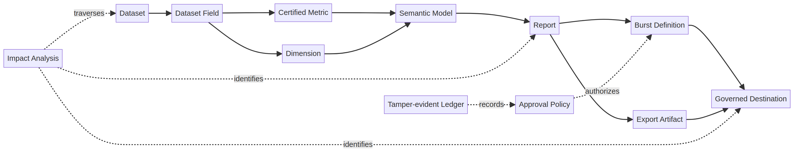

# ReportFlow v2.4 — Lineage، GitOps Policy و CMK/BYOK

**مالک سند:** Enterprise Architecture و Platform Security  
**وضعیت:** هستهٔ lineage پیاده‌سازی و آزموده شده؛ GitOps و CMK/BYOK به‌عنوان طراحی اجرایی production آماده‌اند.  
**دامنه:** semantic model، گزارش، burst، مقصد توزیع، policy، artifact و کلیدهای مشتری‌مالک.



## 1. هدف معماری

ReportFlow اکنون برای هر مسیر تحویل، پاسخ قابل‌اثباتی به سه پرسش ارائه می‌دهد: «این گزارش از کدام dataset و field ساخته شده است؟»، «تغییر یا هشدار روی یک منبع کدام metric، گزارش، burst و مقصد را متاثر می‌کند؟»، و «کدام کنترل policy قبل از ارسال artifact حساس برقرار بوده است؟».

مدل v2.4 با مفاهیم Run، Job و Dataset در استاندارد OpenLineage هم‌راستاست و metadata را در یک graph vendor-neutral نگه می‌دارد؛ استاندارد OpenLineage نیز metadata lineage را حول همین موجودیت‌های اصلی و facetهای قابل‌گسترش تعریف می‌کند. [1] این مدل با الگوی catalogهای سازمانی سازگار است که lineage، impact analysis، data quality و اعتماد به دارایی داده را در یک تجربهٔ واحد قرار می‌دهند. [2]

## 2. آنچه در v2.4 پیاده‌سازی شد

ماژول `reportflow_app/lineage_v24.py` یک graph پایدار SQLite با asset و edgeهای typed اضافه می‌کند. هر asset شناسهٔ deterministic، مالک، classification، metadata canonical و timestamp دارد. هر edge جهت‌دار است و رابطهٔ آن به‌صراحت ثبت می‌شود. برای جلوگیری از سوءاستفاده، metadata حداکثر 64 KiB است، JSON canonical دارد و نام‌های credential مانند `password`، `secret`، `token`، `access_key` و `private_key` در آن رد می‌شوند.

| asset | نمونهٔ شناسه | نقش در graph |
|---|---|---|
| Dataset | `dataset:sales-curated-…` | منبع دادهٔ curated یا connector output |
| Field | `field:sales-curated-net_revenue-…` | ستون dataset و نقطهٔ آغاز impact analysis |
| Metric / Dimension | `metric:sales-model-net-revenue-…` | تعریف semantic و منطق metric/filter |
| Semantic model | `semantic_model:sales-model-v1-…` | قرارداد governed برای metricها و dimensions |
| Report / Burst | `report:101-…` / `burst:finance-burst-…` | مصرف‌کنندهٔ semantic و تعریف توزیع |
| Destination / Artifact | `destination:finance-archive-…` | مرز تحویل و artifact خروجی |

رابط `LineageCatalog.register_semantic_model()` روابط زیر را materialize می‌کند: `dataset → field → metric/dimension → semantic_model`. `register_report()` رابطهٔ `semantic_model → report` را ایجاد می‌کند و `register_burst()` زنجیرهٔ `report → burst → destination` را کامل می‌سازد. `impact_analysis()` با traversal bounded، هم مسیر downstream و هم reverse/upstream را بازمی‌گرداند، count اثر را بر حسب نوع asset ارائه می‌دهد و از cycle جلوگیری می‌کند.

```python
catalog = LineageCatalog(project_store)
catalog.register_semantic_model(model, actor="lineage-worker")
catalog.register_report(report, model.id, classification="restricted")
catalog.register_burst(burst, classification="restricted")

source = lineage_asset_id("field", "sales-curated:net_revenue")
impact = catalog.impact_analysis(source, direction="downstream")
for item in impact.paths:
    print(item.asset.kind, item.asset.display_name, item.path_relations)
```

> **کنترل product:** گزارش effect فقط discovery نیست. پیش از تغییر schema، deprecate کردن metric، downgrade کردن certification یا تغییر مقصد، pipeline باید impact analysis را اجرا و ownerهای assetهای downstream را به approval request وصل کند.

## 3. الگوی عملیاتی impact analysis

| رخداد | شروع traversal | خروجی مورد انتظار | اقدام policy |
|---|---|---|---|
| تغییر column یا schema | Field | metric، semantic model، report، burst، destination متاثر | بلوکه‌کردن promotion تا review ownerها |
| failure یا stale source | Dataset یا Field | گزارش‌های downstream و subscriptionها | کیفیت warning با visibility متناسب و توقف delivery حساس |
| تغییر metric definition | Metric | semantic model و تمامی reportهای وابسته | recertification و evidence card جدید |
| تغییر مقصد خارجی | Destination (upstream) | burst، report، model و sourceهای مربوط | approval دوباره و کنترل classification |
| درخواست حذف داده | Dataset یا Field | artifactها و destinations باقی‌مانده | retention workflow و evidence برای deletion |

Tableau نیز هشدار کیفیت را از دارایی upstream به assetهای downstream نمایش می‌دهد و برای consumerهای گزارش قابل مشاهده می‌سازد. [3] در v2.5، registry ناهنجاری و quality checkهای `SemanticContract` به‌صورت خودکار labelهای `stale`، `deprecated`، `under_maintenance` و `anomalous` را به این graph متصل خواهند کرد.

## 4. قرارداد GitOps برای policyهای ReportFlow

GitOps در ReportFlow به‌معنای ذخیرهٔ policy مطلوب در Git، review‌پذیری Pull Request، اعمال کنترل‌شده به control plane و تشخیص اختلاف میان وضعیت مطلوب و اجراشده است. اصول OpenGitOps بر declarative بودن، versioned/immutable بودن، pull خودکار و continuous reconciliation تکیه دارند. [4]

### گزینه‌های استقرار

| رویکرد | مناسب برای | مزیت | ملاحظه |
|---|---|---|---|
| **Policy در همان repository محصول** | شروع سریع، تیم واحد و یک محیط production | review ساده، traceability مستقیم به release و کمترین overhead | مرز دسترسی tenant و policy reuse محدودتر است |
| **Repository مرکزی policy با promotion محیطی** | چند tenant، چند منطقه یا تیم Platform مستقل | policy reuse، segregation قوی‌تر، rollback و audit متمرکز | نیازمند reconciler و ownership عملیاتی جداگانه است |

هر دو رویکرد باید state مطلوب را declarative نگه دارند. برای وضعیت فعلی ReportFlow، الگوی نخست راه‌اندازی سریع‌تری دارد؛ در گسترش multi-tenant، انتقال policyها به repository مرکزی باید بدون تغییر semantic contract صورت گیرد.

### ساختار پیشنهادی repository

```text
policy/
  schemas/
    distribution-policy.schema.json
    semantic-contract.schema.json
    key-reference.schema.json
  environments/
    dev/
    staging/
    production/
  tenants/
    tenant-a/
      distribution.yaml
      classifications.yaml
      key-references.yaml
  approvals/
    codeowners
  evidence/
    attestations-index.json
```

### نمونه policy declarative

```yaml
apiVersion: reportflow.io/v1
kind: DistributionPolicy
metadata:
  name: restricted-external
  tenant: tenant-a
spec:
  classifications: [confidential, restricted]
  minimumApprovals: 2
  requiredRoles: [data_owner, security_officer]
  requireFreshness: true
  maximumFreshnessHours: 24
  allowedDestinations: [finance-archive, azure-secure-blob]
  keyReference: azure://managedhsm/reportflow-tenant-a-kek/versions/2026-08
  evidenceRetentionDays: 2555
```

### pipeline policy-as-code

| گام | کنترل لازم | evidence |
|---|---|---|
| Lint | schema validation، شناسه‌های مجاز، نبود credential در YAML | CI log و policy digest |
| Test | policy simulation روی requestهای approved/rejected و lineage impact | JUnit/pytest output |
| Review | CODEOWNERS: Data Steward + Security برای restricted policy | PR approval و commit SHA |
| Attest | SBOM/provenance policy bundle و artifact release | attestation subject digest |
| Promote | Environment approval، ref/tag حفاظت‌شده و GitOps reconciler pull | deployment record و policy version |
| Reconcile | اختلاف desired/actual و policy drift alert | reconciliation snapshot و audit event |
| Rollback | promotion به commit immutable قبلی، نه تغییر دستی production | rollback PR و deployment evidence |

GitHub Environment می‌تواند required reviewer، جلوگیری از self-review، branch/tag rule، جلوگیری از admin bypass و secretهای در دسترس بعد از approval را اعمال کند. [5] workflow production ReportFlow باید `production-release` را به tagهای محافظت‌شده محدود کند و policy bundle attested را پیش از دسترسی runner امضا به key reference تأیید نماید.

## 5. طراحی CMK/BYOK

### مفاهیم و مرزها

CMK کلیدی است که چرخهٔ ایجاد، استفاده، rotation و حذف آن زیر کنترل مشتری قرار دارد. BYOK حالت خاصی از CMK است که مشتری key material را از محل خارجی به سرویس مدیریت کلید وارد می‌کند. Azure این دو مفهوم را تفکیک می‌کند و CMK را قابل نگهداری در Key Vault یا HSM مشتری می‌داند. [6] AWS KMS نیز برای key material واردشده BYOK ارائه می‌دهد، اما مشتری را مسئول material اصلی و lifecycle آن می‌داند. [7]

> ReportFlow نباید key material، PFX، HSM PIN یا credential cloud را در SQLite، policy repository، queue payload، lineage metadata یا log ذخیره کند. برنامه فقط یک **Key Reference** versioned و غیرمحرمانه نگه می‌دارد.

### envelope encryption پیشنهادی

1. برای هر artifact یا object حساس، worker یک Data Encryption Key تصادفی و کوتاه‌عمر تولید می‌کند.
2. worker محتوا را با DEK و AEAD مانند AES-256-GCM رمزگذاری می‌کند و `nonce`، `algorithm` و `ciphertext digest` را در manifest ثبت می‌کند.
3. DEK فقط از طریق یک KEK مشتری‌مالک در HSM/KMS wrap می‌شود؛ raw KEK هرگز وارد process ReportFlow نمی‌شود.
4. artifact فقط `wrapped_dek`، `key_reference`، `key_version` و integrity metadata را حمل می‌کند.
5. decrypt به هویت workload، tenant، classification و policy approval وابسته است؛ worker برای unwrap یک token کوتاه‌عمر دریافت می‌کند.

```json
{
  "tenant_id": "tenant-a",
  "classification": "restricted",
  "algorithm": "AES-256-GCM",
  "key_reference": "azure://managedhsm/reportflow-tenant-a-kek",
  "key_version": "2026-08",
  "wrapped_dek": "<base64-ciphertext>",
  "ciphertext_sha256": "<sha256>",
  "policy_version": "git:4d2017f"
}
```

### KeyProvider contract

یک adapter provider-neutral در v2.5 باید فقط عملیات زیر را expose کند: `wrap(dek, key_ref, context)`، `unwrap(wrapped_dek, key_ref, context)`، `get_active_version(key_ref)`، `health(key_ref)` و `rotate(key_ref)`. context باید حداقل `tenant_id`، `artifact_id`، `classification`، `policy_digest` و `purpose=reportflow-artifact` را داشته باشد تا ciphertext swap میان tenantها یا scopeها رد شود.

| provider | استفادهٔ توصیه‌شده | ملاحظهٔ فنی |
|---|---|---|
| Azure Key Vault Premium | CMK با HSM shared و integration Azure | اطمینان از HSM-protected بودن key ضروری است. [6] |
| Azure Managed HSM | نیاز به single-tenant root of trust | security domain باید با فرآیند recovery سازمانی محافظت شود؛ از دست رفتن آن غیرقابل‌بازگشت است. [6] |
| AWS KMS CMK | workloadهای AWS با key policy و CloudTrail | imported material lifecycle، expiration و reimport باید در runbook ثبت شوند. [7] |
| HSM محلی / Cloud HSM | sovereignty، code signing یا PKCS#11/KSP | به runner ایزوله، HA plan و rotation عملیاتی نیاز دارد. [6] |

### rotation، revoke و crypto-erasure

| مرحله | عملیات | کنترل |
|---|---|---|
| Pre-rotation | نسخهٔ جدید KEK و policy reference ایجاد شود | dual-read فعال؛ key قدیمی همچنان decrypt می‌کند |
| New writes | key reference فعال به نسخهٔ جدید تغییر کند | فقط artifact جدید با KEK جدید wrap شود |
| Rewrap | DEKهای artifactهای نگه‌داری‌شده با key جدید rewrap شوند | checkpoint و retry idempotent در queue |
| Retire | deny encrypt با نسخهٔ قدیم؛ decrypt موقتاً برای retention | گزارش coverage و approval Security |
| Revoke / destroy | دسترسی decrypt حذف یا key material طبق policy حذف شود | بررسی legal hold و export evidence پیش از اقدام غیرقابل‌بازگشت |

حذف key می‌تواند به از دست‌رفتن غیرقابل‌بازگشت داده منجر شود. AWS برای حذف KMS key یک waiting period 7 تا 30 روزه مستند می‌کند و برای imported material مکانیزم expiration، delete و reimport دارد. [7] بنابراین ReportFlow باید هیچ‌گاه `destroy` را از مسیر خودکار production اجرا نکند؛ این عملیات نیازمند approval چهارچشمی، retention check و rollback plan است.

## 6. هویت workload و observability

workerهای destination، CMK و signing باید credential دائمی در config نداشته باشند. هویت workload با OIDC/federation یا managed identity باید token کوتاه‌عمر با scope tenant و key-specific دریافت کند. هر operation کلید باید این evidence را به ledger و SIEM بفرستد: `tenant_id`، `key_reference`، `key_version`، `operation`، `artifact_digest`، `policy_digest`، `actor/workload_id`، `decision_id` و `outcome`. هیچ ciphertext، plaintext، wrapped key یا token در event log ثبت نشود.

## 7. معیارهای پذیرش v2.4 و مسیر v2.5

پیاده‌سازی v2.4 با 41 آزمون کامل، syntax compilation، `pip-audit` بدون آسیب‌پذیری شناخته‌شده، Bandit بدون finding و `git diff --check` پاک اعتبارسنجی شده است. آزمون‌های lineage به‌طور مشخص materialization از field تا destination، traversal upstream/downstream، bounded traversal، filter بر اساس asset kind، جلوگیری cycle و رد credential در metadata را پوشش می‌دهند.

v2.5 باید adapterهای واقعی KeyProvider، repository schema validator، policy simulation CLI، drift detector، OpenTelemetry/SIEM export و lineage UI در portal را اضافه کند. پیش از اتصال به KMS production، threat model، penetration test، disaster-recovery exercise و key-rotation drill الزامی است.

## منابع

[1]: https://openlineage.io/docs/spec/object-model/ "OpenLineage — Object Model"
[2]: https://help.tableau.com/current/server/en-us/dm_catalog_overview.htm "Tableau — About Tableau Catalog"
[3]: https://help.tableau.com/current/online/en-us/dm_dqw.htm "Tableau — Data Quality Warnings"
[4]: https://opengitops.dev/ "OpenGitOps Principles"
[5]: https://docs.github.com/actions/deployment/targeting-different-environments/using-environments-for-deployment "GitHub Docs — Managing environments for deployment"
[6]: https://learn.microsoft.com/en-us/azure/security/fundamentals/key-management "Microsoft Learn — Overview of key management in Azure"
[7]: https://docs.aws.amazon.com/kms/latest/developerguide/importing-keys.html "AWS KMS — Importing key material"
