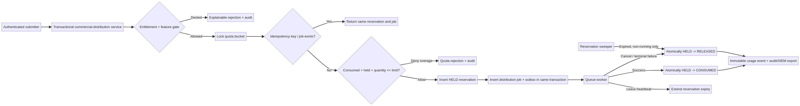

# ReportFlow v2.6 — معماری Atomic Quota Reservation و مدیریت سهمیه

**وضعیت:** طرح فنی پیشنهادی برای کنترل‌پلین سازمانی.  
**دامنه:** جلوگیری از oversubscription میان preflight و delivery در صف توزیع.  
**خارج از دامنه:** payment capture، invoice generation، tax، یا نگه‌داری payment credential.



## 1. مسئلهٔ دقیق در v2.5

در v2.5، `CommercialDistributionGate.enqueue_entitled()` ابتدا `preflight_usage()` را اجرا و سپس job را در `DistributionQueue` ثبت می‌کند. `preflight_usage()` فقط aggregate رخدادهای **مصرف‌شده** را می‌بیند و هیچ hold پایدار برای کار در صف ایجاد نمی‌کند. در نتیجه، دو درخواست هم‌زمان می‌توانند quota باقی‌ماندهٔ یکسان را معتبر ببینند، هر دو queue شوند، و تنها در زمان `record_success()` با محدودیت برخورد کنند. این فاصلهٔ زمانی، race بین **پذیرش کار** و **مصرف واقعی** است.

> **هدف v2.6:** برای هر job قابل bill شدن، سهمیه را پیش از enqueue به‌طور اتمیک نگه‌داری کنیم، سپس همان hold را در success مصرف و در cancellation/terminal failure آزاد کنیم.

## 2. اصول طراحی غیرقابل‌مذاکره

| اصل | الزام معماری |
|---|---|
| Idempotency end-to-end | یک idempotency key باید همواره همان reservation و همان job را برگرداند؛ هرگز hold یا usage دوم نسازد. |
| Atomic admission | entitlement check، feature gate، lock bucket، reservation و job/outbox باید در یک transaction باشد. |
| Stable commercial evidence | reservation و usage event باید plan/version، entitlement effective time و billing-period snapshot را نگه دارند. |
| Release never deletes history | hold آزادشده `released` می‌شود؛ حذف فیزیکی برای mutation جاری مجاز نیست. |
| Worker-safe lifecycle | فقط worker با lease معتبر می‌تواند consume کند؛ heartbeat مدت hold را در زمان اجرای واقعی افزایش می‌دهد. |
| Least privilege | caller فقط tenant خودش را submit می‌کند؛ worker identity جداگانه فقط state transition مجاز را اجرا می‌کند. |
| Explainable denial | quota rejection باید limit، consumed، held، requested و policy را بدون PII در audit ثبت کند. |

## 3. مدل دادهٔ پیشنهادی

### 3.1 Bucketهای دوره‌ای

`quota_buckets` برای یک tenant، meter و billing period یک ردیف mutable کنترل‌شده دارد. این ردیف تنها محل aggregate write است.

| ستون | نوع مفهومی | توضیح |
|---|---|---|
| `tenant_id`, `meter`, `billing_period` | composite primary key | scope دقیق سهمیه |
| `plan_id`, `plan_version`, `entitlement_effective_from` | snapshot | commercial contract حاکم بر bucket |
| `included_units` | integer | limit effective برای این period |
| `consumed_units` | integer | deliveryهای موفق و مصرف‌شده |
| `held_units` | integer | quota رزرو شده برای jobهای هنوز نهایی‌نشده |
| `overage_held_units`, `overage_consumed_units` | integer | تفکیک روشن policy `allow` |
| `row_version` | integer | optimistic/audit version برای export و debugging |
| `updated_at` | UTC timestamp | time of latest transaction |

فرمول قابلیت پذیرش برای policy `deny` به‌شکل زیر است:

```text
available = included_units - consumed_units - held_units
allow iff requested_units <= available
```

برای policy `allow`، reservation همچنان انجام می‌شود؛ اما واحدهای بالاتر از included limit در `overage_held_units` ثبت خواهند شد تا بعداً قابل reconciliation باشند.

### 3.2 Reservation ledger

| ستون | توضیح |
|---|---|
| `id` | UUID داخلی reservation |
| `tenant_id`, `meter`, `billing_period` | scope bucket |
| `distribution_job_id` | foreign key به job؛ پس از admission ایجاد می‌شود |
| `idempotency_key` | unique؛ از admission تکراری جلوگیری می‌کند |
| `quantity` | واحدهای نگه‌داری‌شده |
| `state` | `held`, `consumed`, `released`, `expired` |
| `reason` | `enqueue`, `success`, `cancelled`, `dead_letter`, `ttl_expiry`, `manual_adjustment` |
| `plan_id`, `plan_version`, `entitlement_effective_from` | snapshot غیرقابل‌تغییر |
| `expires_at`, `last_heartbeat_at` | کنترل TTL و worker lease |
| `created_at`, `finalized_at` | traceability |
| `actor_subject`, `worker_id` | identity audit-safe؛ بدون recipient PII |

**Constraintهای حیاتی:**

```sql
UNIQUE (idempotency_key);
CHECK (quantity > 0);
CHECK (state IN ('held','consumed','released','expired'));
CHECK (finalized_at IS NULL OR state IN ('consumed','released','expired'));
CREATE INDEX reservation_sweep_idx ON quota_reservations(state, expires_at);
CREATE INDEX reservation_job_idx ON quota_reservations(distribution_job_id);
```

### 3.3 Transactional outbox

در همان transaction admission، یک `outbox_event` برای انتشار durable job به worker نوشته می‌شود. worker از outbox queue را تغذیه می‌کند؛ بنابراین failure بین SQL commit و broker publish باعث job گمشده نمی‌شود.

| event | trigger | consumer |
|---|---|---|
| `distribution.admitted` | reservation `held` + job ایجاد شد | queue publisher |
| `quota.consumed` | delivery success | metering/export worker |
| `quota.released` | cancel, terminal failure یا expiry امن | quota monitoring / audit sink |

## 4. تراکنش‌های state machine

### 4.1 Admission اتمیک: reserve + enqueue

در دیتابیس مرکزی، service باید transaction زیر را اجرا کند. در PostgreSQL، lock با `SELECT ... FOR UPDATE` روی bucket انجام می‌شود. در SQLite pilot، همان semantics با `BEGIN IMMEDIATE` وجود دارد، اما تنها برای یک process/host مناسب است.

```sql
BEGIN;

-- 1. validate OIDC subject, tenant scope, feature entitlement and billing period server-side
-- 2. first check idempotency; existing request returns its original reservation/job
SELECT * FROM quota_reservations WHERE idempotency_key = :key;

-- 3. lock or create the one quota bucket
SELECT * FROM quota_buckets
WHERE tenant_id = :tenant AND meter = :meter AND billing_period = :period
FOR UPDATE;

-- 4. reject or compute overage using consumed + held + requested
-- 5. insert reservation HELD; atomically increment held_units
INSERT INTO quota_reservations (..., state, quantity, expires_at, ...)
VALUES (..., 'held', :quantity, :expires_at, ...);
UPDATE quota_buckets
SET held_units = held_units + :quantity, row_version = row_version + 1, updated_at = NOW()
WHERE tenant_id = :tenant AND meter = :meter AND billing_period = :period;

-- 6. insert distribution job and outbox event in the same transaction
INSERT INTO distribution_jobs (...);
INSERT INTO outbox_events (..., event_type, aggregate_id) VALUES (..., 'distribution.admitted', :job_id);
COMMIT;
```

اگر هر step fail شود، transaction rollback می‌شود؛ بنابراین job بدون hold یا hold بدون job باقی نمی‌ماند. پاسخ admission شامل `reservation_id`، `job_id`، `expires_at` و commercial snapshot است.

### 4.2 Success: consume reservation

worker فقط با lease معتبر queue می‌تواند transition انجام دهد. روی success، job status و reservation state باید در یک transaction به‌روز شوند.

```text
assert job.status == running AND job.lease_token == presented_lease
assert reservation.state == held AND reservation.distribution_job_id == job.id
UPDATE quota_buckets:
  held_units     -= reservation.quantity
  consumed_units += reservation.quantity
UPDATE quota_reservations SET state='consumed', finalized_at=now
UPDATE distribution_jobs SET status='succeeded', lease_token=NULL
INSERT immutable usage_event with reservation_id and commercial snapshot
INSERT outbox_event quota.consumed
commit
```

اگر worker بعد از انجام destination side effect و قبل از commit crash کند، delivery endpoint باید idempotency key job را دریافت کند. در retry، worker همان side effect key و همان reservation را ادامه می‌دهد، نه یک delivery یا charge جدید.

### 4.3 Cancel، dead letter و release

| رخداد queue | شرط | transition quota |
|---|---|---|
| user cancel | job هنوز `queued` یا `retry` | `held → released` و `held_units -= quantity` |
| terminal failure / DLQ | retryها تمام شده یا non-retryable error | `held → released` با reason `dead_letter` |
| worker success | lease معتبر | `held → consumed` و usage event immutable |
| enqueue rejection | transaction commit نشده | هیچ reservation یا jobی ساخته نمی‌شود |

### 4.4 TTL، heartbeat و recovery

TTL فقط safety net است؛ نباید source of truth برای یک job در حال اجرا باشد. `reservation.expires_at` باید حداقل برابر با queue lease باشد. worker در heartbeat معتبر، `expires_at` را تا انتهای lease جدید تمدید می‌کند. sweeper تنها holdهایی را `expired/released` می‌کند که هم TTLشان گذشته و هم jobشان در وضعیت `queued`, `retry`, `cancelled` یا `dead_letter` است؛ job `running` با lease معتبر از release خودکار مستثناست.

برای lease منقضی‌شده، queue ابتدا job را به retry برمی‌گرداند و همان reservation را نگه می‌دارد. اگر job از DLQ عبور کند، release انجام می‌شود. ترتیب recovery باید job state و reservation state را در transaction مشترک تغییر دهد.

## 5. API boundary و امنیت

| operation | actor مجاز | idempotency | پاسخ مطلوب |
|---|---|---|---|
| `POST /v2/distribution/admissions` | tenant-scoped submitter | client request key | reservation + job یا explainable quota denial |
| `POST /v2/reservations/{id}/heartbeat` | workload worker با lease | `(reservation, lease epoch)` | expiry تمدیدشده |
| `POST /v2/jobs/{id}/succeed` | workload worker با lease | job key | usage event موجود یا consumption جدید |
| `POST /v2/jobs/{id}/fail` | workload worker با lease | job key | retry یا release/dlq status |
| `GET /v2/quota` | tenant admin / finance role | ندارد | consumed, held, available, overage با period server-selected |
| `POST /v2/quota-adjustments` | billing admin + four-eyes approval | adjustment key | immutable adjustment ledger entry |

tenant ID نباید از body بدون کنترل پذیرفته شود؛ باید از OIDC claim، session یا workload binding استخراج و با resource ownership match شود. billing period در production توسط calendar service تعیین می‌شود، نه با string آزاد caller. client payload از metadata usage جدا می‌ماند و PII recipient هرگز وارد metering ledger نمی‌شود.

## 6. گزینه‌های استقرار

| رویکرد | مناسب برای | مزیت | محدودیت | پیچیدگی راه‌اندازی |
|---|---|---|---|---|
| **A. SQLite single-control-plane** | desktop/local pilot و یک worker محدود | تغییر کوچک؛ `BEGIN IMMEDIATE` و schema فعلی قابل استفاده‌اند | single writer، نبود HA، نامناسب برای multi-host یا regional service | کم |
| **B. PostgreSQL control plane + transactional outbox** | Enterprise multi-worker و production SaaS | row lock، HA، reliable outbox، observability و migration بهتر | نیازمند سرویس مرکزی، backup/DR و عملیات دیتابیس | متوسط تا زیاد |

راه A مسیر سبک برای اثبات جریان reservation است. راه B برای صف مرکزی چندworker و SLA سازمانی طراحی می‌شود. انتخاب باید بر اساس تعداد worker، نیاز HA، مدل deployment و appetite عملیاتی انجام شود؛ هیچ‌کدام به‌تنهایی جایگزین authorization، monitoring یا release process نیست.

## 7. برنامهٔ migration بدون از دست دادن evidence

| گام | تغییر | کنترل rollback |
|---|---|---|
| 0. Baseline | snapshot از usage events و entitlementها؛ validate invariants | restore verified و گزارش اختلاف |
| 1. Expand schema | افزودن `quota_buckets`, `quota_reservations`, `outbox_events` بدون تغییر مسیر موجود | feature flag خاموش؛ جدول‌ها بلااستفاده‌اند |
| 2. Backfill | `consumed_units` از usage events تاریخی per tenant/meter/period محاسبه شود؛ `held=0` | checksum per bucket و reconciliation report |
| 3. Shadow admission | reservation را محاسبه و audit کنید اما queue هنوز v2.5 را اجرا کند | هیچ state تجاری enforce نمی‌شود |
| 4. Canary | یک tenant داخلی/طراحی‌شده با feature flag `atomic_quota_v26`؛ admission جدید فقط برای همان tenant | flag off؛ holdهای موجود تا final state lifecycle می‌گیرند |
| 5. Controlled rollout | tenant به tenant، monitor oversubscription/release/TTL | pause rollout؛ new admission به safe deny یا v2.5 policy طبق contract |
| 6. Enforce | preflight مستقل v2.5 deprecated؛ همهٔ distributionهای billable از admission service عبور می‌کنند | migration log و dual-read برای دورهٔ تثبیت |

rollback نباید reservation یا usage history را delete کند. rollback فقط مسیر **admission جدید** را تغییر می‌دهد؛ reservationهای موجود باید consume یا release شوند تا `held_units` orphan نشود.

## 8. آزمون‌ها و observability اجباری

| دسته | سناریوی حداقلی |
|---|---|
| Concurrency | دو admission هم‌زمان برای آخرین واحد quota؛ دقیقاً یکی قبول شود در policy `deny` |
| Idempotency | retry همان key همان `reservation_id` و `job_id` را برگرداند |
| Failure atomicity | fail قبل از commit هیچ job/hold نسازد؛ fail پس از commit با outbox recover شود |
| Lifecycle | success consume؛ cancel و terminal fail release؛ retry hold را حفظ کند |
| TTL/lease | sweeper هرگز hold job running با lease معتبر را آزاد نکند؛ heartbeat expiry را تمدید کند |
| Commercial snapshot | plan upgrade پس از hold، snapshot reservation و usage قبلی را تغییر ندهد |
| Authorization | tenant A نتواند quota/reservation tenant B را مشاهده یا transition دهد |
| Reconciliation | `consumed + held` با ledger states و usage events سازگار بماند |

metricهای عملیاتی شامل `quota_held_units`, `quota_available_units`, `reservation_created_total`, `reservation_consumed_total`, `reservation_released_total`, `reservation_expired_total`, `admission_denied_total` و `outbox_lag_seconds` هستند. alertهای اولیه باید holdهای نزدیک TTL، negative bucket invariant، outbox lag و رشد غیرعادی release/dead-letter را پوشش دهند.

## 9. تصمیم‌های باز پیش از implementation

1. آیا هر delivery در لحظهٔ enqueue یک واحد reservation می‌گیرد یا meterهای حجمی باید estimate/reserve جزئی داشته باشند؟
2. آیا contract اجازهٔ overage `allow` می‌دهد یا تمام pilotها باید `deny` باشند؟
3. آیا production نیازمند PostgreSQL و multi-region HA است یا یک control plane تک‌منطقه‌ای کافی است؟
4. retention و encryption ledger برای هر region/tenant چه مدت و تحت کدام CMK/BYOK policy است؟
5. workflow four-eyes approval برای manual quota adjustment چگونه به governance v2.3 متصل می‌شود؟

پاسخ این تصمیم‌ها، implementation plan را تغییر می‌دهد. تا آن زمان، طرح v2.6 باید به‌عنوان architecture proposal و نه contract تجاری نهایی تلقی شود.
