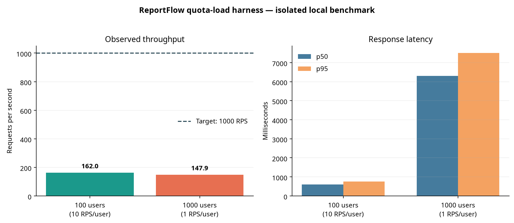

# ReportFlow v2.7 — DLQ، Backoff نمایی و Benchmark سرویس سهمیه

**وضعیت:** اجرای محلی و ایزوله؛ معیار production یا تعهد ظرفیت نیست.  
**تاریخ اجرا:** ۱۵ اوت ۲۰۲۶.  
**دامنه:** `PostgresQuotaReservationService.admit()` از طریق API harness مصنوعی، PostgreSQL disposable و Locust. هیچ دادهٔ مشتری، credential production یا endpoint production در آزمایش استفاده نشده است.

## 1. تصمیم طراحی DLQ و retry

v2.7 مسیر retry outbox را از retry با تأخیر ثابت به **backoff نمایی با full jitter** ارتقا می‌دهد. برای attempt شمارهٔ `n`، سقف تأخیر `min(max_delay, base_delay × 2^(n−1))` است و delay واقعی به‌صورت یکنواخت در بازهٔ صفر تا همان سقف انتخاب می‌شود؛ پیاده‌سازی حداقل یک ثانیه delay اعمال می‌کند تا busy-loop رخ ندهد. هدف این طراحی، کاهش هم‌زمانی retryها پس از خطای broker و جلوگیری از retry storm است.

پس از رسیدن `publish_attempts` به `max_attempts`، event به حالت terminal DLQ منتقل می‌شود. payload و تعداد attemptها حفظ می‌شوند اما event دیگر در claim query قرار نمی‌گیرد. انتقال DLQ مانند publish و defer به lease token، lease owner و زمان انقضا مقید است تا worker منقضی یا worker دیگر نتواند event را تغییر دهد.

| جزء | پیاده‌سازی v2.7 | invariant |
|---|---|---|
| Retry policy | `ExponentialBackoffPolicy` با `max_attempts`، `base_delay_seconds` و `max_delay_seconds` | jitter فقط delay را تعیین می‌کند و تاریخچهٔ attempt را تغییر نمی‌دهد |
| Event آماده | `available_at <= now()` و `dead_lettered_at IS NULL` | event delayخورده یا DLQ دوباره claim نمی‌شود |
| DLQ | `dead_lettered_at`، `dead_letter_reason` و `dead_lettered_by` | event terminal publish‌شده محسوب نمی‌شود، اما برای audit باقی می‌ماند |
| Claim | `FOR UPDATE SKIP LOCKED` با index مخصوص ready event | publisherهای هم‌زمان به انتظار head-of-line نمی‌روند |
| Lease safety | token، owner و `lease_expires_at >= now()` در ack/defer/DLQ | state transition پس از expiry رد می‌شود |

## 2. سناریوی بار

حجم بار با Locust و API harness انجام شد. Locust روی همان sandbox با API و PostgreSQL اجرا شد؛ بنابراین client و server برای CPU و حافظه رقابت می‌کنند. API با یک process Uvicorn و service فعلی که برای هر admission connection PostgreSQL کوتاه‌مدت باز می‌کند اجرا شد. این ترکیب **عمداً benchmark production نیست**؛ هدف آن پیدا کردن حد پایدار reference implementation و ایجاد baseline تکرارپذیر است.

هر request یک `AdmissionRequest` مصنوعی با ۱۲۸ tenant/quota scope مستقل ایجاد کرد. policy متراژ `allow` و included quota بزرگ بود تا اندازه‌گیری به denial quota محدود نشود. Locust برای هر کاربر `constant_throughput` به کار برد؛ در اجرای اصلی، ۱٬۰۰۰ کاربر هر یک با نرخ هدف یک درخواست‌برثانیه فعال شدند.

| اجرا | پیکربندی هدف | درخواست ثبت‌شده | خطا | throughput مشاهده‌شده | p50 | p95 | نتیجه |
|---|---:|---:|---:|---:|---:|---:|---|
| Warm/saturation probe | ۱۰۰ کاربر × ۱۰ RPS | ۵٬۵۷۳ | ۰٪ | ۱۶۲٫۳ RPS | ۶۰۰ ms | ۷۵۰ ms | بدون خطای HTTP، اما زیر هدف |
| Target run | ۱٬۰۰۰ کاربر × ۱ RPS | ۵٬۰۳۷ | ۰٪ | ۱۴۷٫۹ RPS | ۶٬۳۰۰ ms | ۷٬۵۰۰ ms | هدف ۱٬۰۰۰ RPS محقق نشد |

> **نتیجهٔ قابل‌اعتماد:** reference implementation در این ماشین محلی، زیر فشار هدف ۱٬۰۰۰ RPS پایدار از نظر HTTP بود اما ظرفیت/latency هدف را برآورده نکرد. throughput در حدود ۱۴۸ تا ۱۶۲ RPS مشاهده شد و افزایش concurrency، p50 را از ۶۰۰ ms به ۶٬۳۰۰ ms رساند. بنابراین این نتیجه نباید به‌عنوان تأیید آمادگی production در ۱٬۰۰۰ RPS تفسیر شود.

## 3. تفسیر و اقدام‌های مهندسی

نتیجه علت منفرد را اثبات نمی‌کند، اما سه گلوگاه در design harness محتمل هستند: ایجاد connection جدید PostgreSQL برای هر admission، process تک‌worker API و اجرای generator بار روی همان host. مسیر بعدی باید با اندازه‌گیری مرحله‌ای انجام شود و نه با افزایش کورکورانهٔ workerها.

| گزینه | مزیت | trade-off | معیار پذیرش پیشنهادی |
|---|---|---|---|
| Connection pool و API چندworker | حذف هزینهٔ connect per request و افزایش parallelism کنترل‌شده | نیاز به sizing pool، timeout و observability | p95 و error rate در baseline جداگانه ثبت شوند |
| اجرای generator بار روی host جدا | تفکیک توان client از service | پیچیدگی setup بیشتر | throughput server مستقل از CPU Locust سنجیده شود |
| PostgreSQL managed/تخصیص‌یافته | کنترل بهتر IO، connection و metrics | هزینه و عملیات بیشتر | saturation با CPU/IO/connection metrics اثبات شود |
| Batch admission و queueing front-door | افزایش efficiency برای burstهای تجاری | semantics و idempotency پیچیده‌تر | strict per-tenant isolation و audit حفظ شود |

قبل از هر ادعای ظرفیت، باید benchmark دوباره روی staging ایزوله با telemetry شامل pool saturation، `pg_stat_activity`، lock wait، CPU/IO، outbox lag و latency broker انجام شود. استفاده از ۱٬۰۰۰ RPS در production بدون این سنجش، به‌ویژه با connection-per-request، مجاز نیست.

## 4. اعتبارسنجی کد

آزمون‌های واحد DLQ/full-jitter و service quota، **۱۳ pass** بودند. آزمون‌های integration واقعی PostgreSQL برای oversubscription، idempotency storm، claim هم‌زمان دو publisher و terminal DLQ، **۴ pass** بودند. API harness پس از پایان benchmark متوقف شد.

## 5. فایل‌های مرتبط

| فایل | نقش |
|---|---|
| `reportflow_app/postgres_quota_v26.py` | `ExponentialBackoffPolicy`، transition DLQ و worker policy |
| `migrations/postgres/003_v27_outbox_dead_letter.sql` | schema و index DLQ |
| `tools/load/quota_load_api.py` | API synthetic و ایزوله برای آزمایش بار |
| `tools/load/locust_quota_admission.py` | workload کنترل‌شدهٔ Locust |
| `tools/load/prepare_quota_load_db.py` | آماده‌سازی دیتابیس disposable |
| `tests/integration/test_postgres_quota_v261_concurrency.py` | آزمون واقعی concurrent admission، claim و DLQ |

## References

[1]: https://www.postgresql.org/docs/current/sql-select.html "PostgreSQL Documentation — SELECT and SKIP LOCKED"
[2]: https://www.postgresql.org/docs/current/explicit-locking.html "PostgreSQL Documentation — Explicit Locking"
[3]: https://docs.locust.io/en/stable/ "Locust Documentation"
