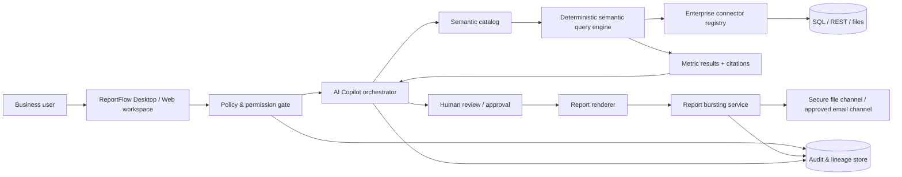

# معماری نسخهٔ 2.0: AI Copilot، Semantic Layer و توزیع سازمانی

**وضعیت:** طراحی اجرایی و قراردادهای پایهٔ کد  
**مخاطب:** تیم محصول، مهندسی داده، امنیت، فروش فنی و مشتریان Enterprise

## 1. مسئله و اصل طراحی

ReportFlow v2.0 نباید یک LLM را مستقیماً به جدول‌های خام یا پایگاه‌دادهٔ مشتری متصل کند. مسیر درست، اجرای محاسبات قطعی بر مبنای یک **Semantic Layer حاکمیت‌شده** و سپس استفاده از AI برای توضیح، پرسش و پیشنهاد است. لایهٔ معنایی تعریف واحد KPIها، dimensionها، lineage، مالک داده، سطح حساسیت و سیاست دسترسی را نگهداری می‌کند؛ Copilot تنها به همین context محدودشده و نتایج محاسبه‌شده دسترسی خواهد داشت.

> «AI در ReportFlow پاسخ را روایت می‌کند؛ موتور semantic محاسبه را انجام می‌دهد.»

این تفکیک، خطای ناشی از پرس‌وجوی مبهم، محاسبهٔ نادرست و تفسیر ناسازگار را کاهش می‌دهد. مستندات Microsoft نیز آماده‌سازی model، نام‌گذاری انسان‌فهم، description و تست خروجی Copilot را پیش‌نیاز کاهش پاسخ‌های کم‌کیفیت می‌داند.[1] Looker semantic layer را برای تعریف متمرکز metrics/dimensions و grounding ابزارهای AI به منطق تجاری، به‌جای جدول خام، به‌کار می‌گیرد.[2]

## 2. معماری هدف

| لایه | مسئولیت | دادهٔ مجاز | منع صریح |
|---|---|---|---|
| Connector | اتصال فقط‌خواندنی، validation و تبدیل data source به DataFrame | query/template تأییدشده، secret از vault | ذخیرهٔ password در config یا report definition |
| Semantic catalog | تعریف KPI، dimension، synonym، owner، sensitivity و lineage | metadata و business rules | اجرای query دلخواه یا تغییر مستقیم منبع |
| Semantic engine | اجرای aggregation قطعی و whitelist شده | DataFrame فیلترشده و metric definitions | تولید SQL توسط LLM |
| Copilot | انتخاب واژگان تجاری، توضیح نتیجه، سؤال clarification و narrative draft | semantic snapshot و results مجاز | دسترسی مستقیم به raw data یا secret |
| Bursting | mapping گیرنده→filter، rendering و تحویل کنترل‌شده | recipient mapping و output فیلترشده | ارسال بدون dry-run/approval یا bypass policy |
| Audit | ثبت actor، policy decision، lineage و outcome | metadata حداقلی و hash artifacts | ثبت secret یا payload خام حساس |

## 3. Semantic Layer

### 3.1 قرارداد مدل

هر semantic model شامل این اجزاست:

| جزء | نمونه | کنترل حاکمیتی |
|---|---|---|
| Dataset | `sales_performance` | connector ID، owner، freshness SLA و classification |
| Dimension | `region`, `period`, `customer_segment` | field source، display label، synonyms و filterability |
| Metric | `net_revenue`, `gross_margin_pct` | aggregation whitelist، formula، format، owner و certification status |
| Relationship | `sales → calendar` | cardinality، join key و approved path |
| Policy | `region = actor.region` | tenant/region/role/label، deny-by-default |
| Lineage | `metric → fields → connector → source` | version، approver و effective date |

تعریف metric باید versioned، code-reviewed و testable باشد. v2.0 در هستهٔ محلی، aggregationهای deterministic مثل `sum`، `average`، `count`، `distinct_count`، `min` و `max` را اجرا می‌کند. formulaهای ترکیبی در یک DSL محدود و whitelist‌شده اضافه می‌شوند؛ هیچ expression دلخواه Python یا SQL از کاربر/LLM اجرا نخواهد شد.

### 3.2 جریان ایجاد و انتشار

1. Data steward منبع و contract آن را ثبت می‌کند.
2. Analyst dimensionها و metricها را در draft semantic model تعریف می‌کند.
3. Owner کسب‌وکار definition، نام، synonym، محاسبه و threshold را تأیید می‌کند.
4. کنترل کیفیت freshness، null-rate و reconciliation اجرا می‌شود.
5. مدل با version immutable منتشر و برای Report Builder و Copilot قابل استفاده می‌شود.
6. هر تغییر metric باعث ایجاد version جدید و حفظ lineage خروجی‌های گذشته خواهد شد.

> RLS باید تا حد ممکن نزدیک منبع یا data policy متمرکز enforce شود، نه صرفاً در گزارش. Tableau نیز data policy یا RLS در پایگاه‌داده را راهکار کم‌نگهداری‌تر و امن‌تر از filter دستی در هر workbook می‌داند.[3]

## 4. AI Copilot

### 4.1 تجربه‌های نسخهٔ v2.0

| تجربه | ورودی | خروجی | تصمیم نهایی |
|---|---|---|---|
| Explain KPI | یک metric و period | تعریف، مقدار، تغییر و citation lineage | کاربر |
| Executive narrative | metric results قطعی و segmentهای منتخب | خلاصهٔ مدیریتی، opportunity، risk و سؤال‌های باز | کاربر/approver |
| Variance explanation | actual/budget و dimensions مجاز | عوامل محتمل مبتنی بر breakdown قابل‌مشاهده | analyst |
| Report builder assistant | هدف گزارش و semantic catalog | پیشنهاد metric، layout و required filters | report author |
| Data-quality copilot | profile و rule outcome | هشدار، علت محتمل و گام remediation | data steward |

### 4.2 جریان پاسخ امن

1. **Authentication & authorization:** actor، tenant و policy context تعیین می‌شود.
2. **Grounding reduction:** فقط metric definitions، dimensions visible، approved filters و نتایج عددی لازم به prompt افزوده می‌شوند.
3. **Deterministic execution:** semantic engine metricها را اجرا و citationها را تولید می‌کند.
4. **Narrative generation:** LLM صرفاً narrative ساختاریافته شامل answer، assumptions، citations و confidence می‌سازد.
5. **Validation:** schema validation، citation presence، allowed metric IDs و disclosure policy بررسی می‌شود.
6. **Review & audit:** خروجی برای external delivery نیازمند approval است؛ prompt hash، model ID، semantic model version و policy decision ثبت می‌شود.

Copilot باید پاسخ را draft بداند، نه حقیقت قطعی. Microsoft نیز تأکید می‌کند خروجی generative AI صددرصد factual تضمین نمی‌شود و باید پیش از ارسال review شود.[4]

### 4.3 انتخاب مدل و هزینه

در محصول نهایی، provider قابل‌تعویض خواهد بود: Azure OpenAI، OpenAI-compatible private gateway یا مدل private/VPC. محیط ReportFlow **هرگز** نباید API key را در source code یا semantic model ذخیره کند؛ reference به secret در vault ثبت می‌شود. برای summary و narrative روزمره، مدل سریع/اقتصادی؛ برای تحلیل پیچیده و review workflow، مدل reasoning قوی‌تر با سقف هزینه per-workspace انتخاب می‌شود. قابلیت AI باید opt-in، قابل خاموش‌کردن در سطح tenant و دارای data-residency policy باشد.

## 5. Enterprise Connectors

v2.0 یک registry مبتنی بر profile ایجاد می‌کند. profile شامل نوع connector، settings غیرحساس، credential reference، owner و classification است. connector فقط query یا endpoint از پیش تأییدشده را می‌پذیرد؛ raw credential از vault سیستم‌عامل یا secrets manager خوانده می‌شود.

| Connector | وضعیت کد v2.0 | کنترل‌های ضروری برای production |
|---|---|---|
| CSV / Excel | موجود در v1.0 | schema contract، virus/content scan، freshness check |
| SQLite read-only | پیاده‌سازی‌شده | immutable/read-only URI، query allowlist و path policy |
| PostgreSQL | adapter آماده با driver اختیاری | TLS، least-privilege DB role، parameterized query و database RLS |
| SQL Server | adapter آماده با driver اختیاری | Entra/Windows auth، encrypted connection، database RLS و query timeout |
| REST JSON | پیاده‌سازی‌شده | HTTPS-only، allowlisted domain، OAuth/API key از vault، rate limit و response-size cap |

## 6. Report Bursting

Report bursting در v2.0 یک workflow مستقل است: یک report definition، یک recipient mapping، یک filter dimension، یک delivery channel و یک approval policy. برای هر recipient، engine ابتدا policy و filter را اعمال، سپس یک artifact جدا render و تحویل می‌دهد.

| کنترل | پیاده‌سازی پایه | الزام Enterprise |
|---|---|---|
| Recipient mapping | CSV یا semantic dataset شامل email و filter value | sync از IdP/CRM و approval owner |
| Filter | equality filter روی field انتخاب‌شده | dynamic RLS/ABAC و policy engine |
| Delivery | secure local file channel؛ SMTP adapter با opt-in | Teams/Slack/SFTP/email gateway و DLP |
| Safety | `dry_run=True` پیش‌فرض و recipient limit | approval gate، send window و quarantine |
| Evidence | artifact path، status و recipient identifier | immutable delivery evidence، retention و SIEM export |

Power BI برای dynamic per-recipient subscriptions نیز یک semantic model جداگانه برای mapping گیرنده به filters استفاده می‌کند و هنگام ارسال از دادهٔ به‌روز همان model بهره می‌گیرد.[5] همین الگو در ReportFlow به‌صورت vendor-neutral پیاده می‌شود.

## 7. معیار پذیرش v2.0

| مورد | معیار پذیرش |
|---|---|
| Semantic catalog | metric versioned، owner، definition، sensitivity و lineage دارد |
| Copilot | به raw source یا secret دسترسی ندارد و citation metrics را برمی‌گرداند |
| Connectors | read-only، timeout/size limit، credential reference و test connection دارند |
| Bursting | recipient-specific artifact می‌سازد، dry-run پیش‌فرض است و filter bypass نمی‌شود |
| Security | هیچ credential در log، source، report definition یا artifact manifest ظاهر نمی‌شود |
| Audit | اجرای connector، semantic version، burst policy و AI model metadata ثبت می‌شود |

## منابع

[1]: https://learn.microsoft.com/en-us/power-bi/create-reports/copilot-semantic-models "Microsoft Learn — Use Copilot with semantic models"
[2]: https://cloud.google.com/blog/products/business-intelligence/how-lookers-semantic-layer-enhances-gen-ai-trustworthiness "Google Cloud — How Looker’s semantic layer enables trusted AI for BI"
[3]: https://help.tableau.com/current/server/en-us/rls_options_overview.htm "Tableau — Overview of Row-Level Security Options"
[4]: https://learn.microsoft.com/en-us/microsoft-365/copilot/microsoft-365-copilot-privacy "Microsoft Learn — Data, Privacy, and Security for Microsoft 365 Copilot"
[5]: https://learn.microsoft.com/en-us/power-bi/collaborate-share/power-bi-dynamic-report-subscriptions "Microsoft Learn — Dynamic per recipient subscriptions for reports"
